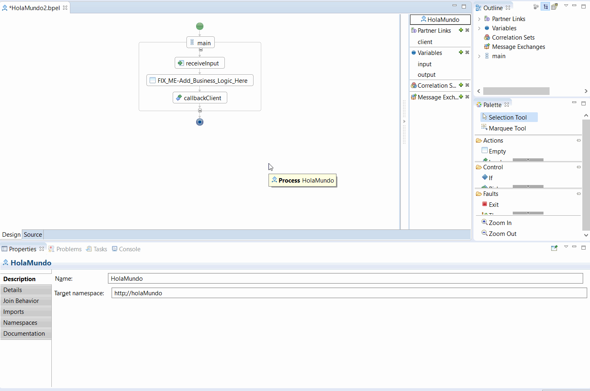
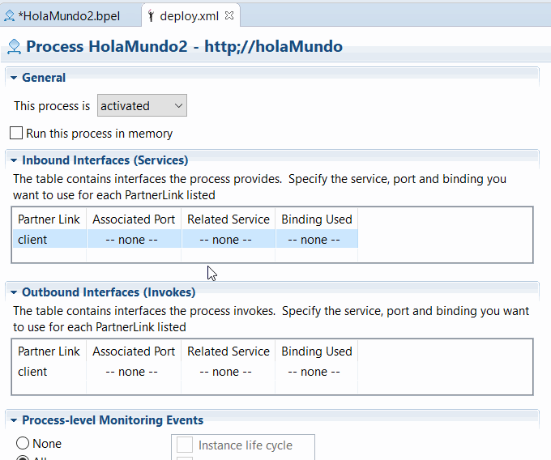
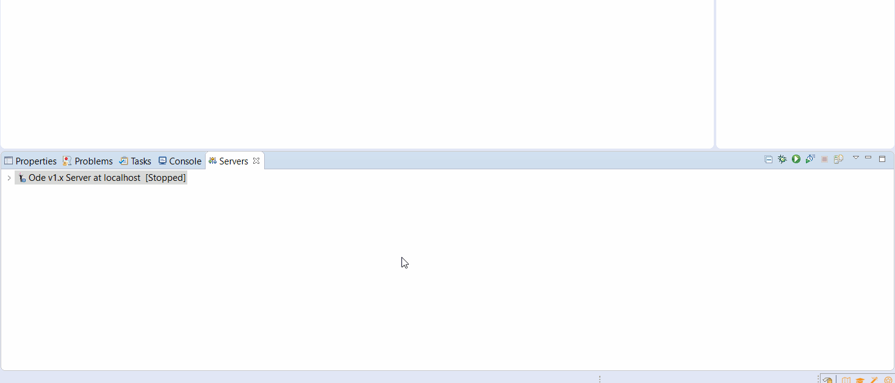
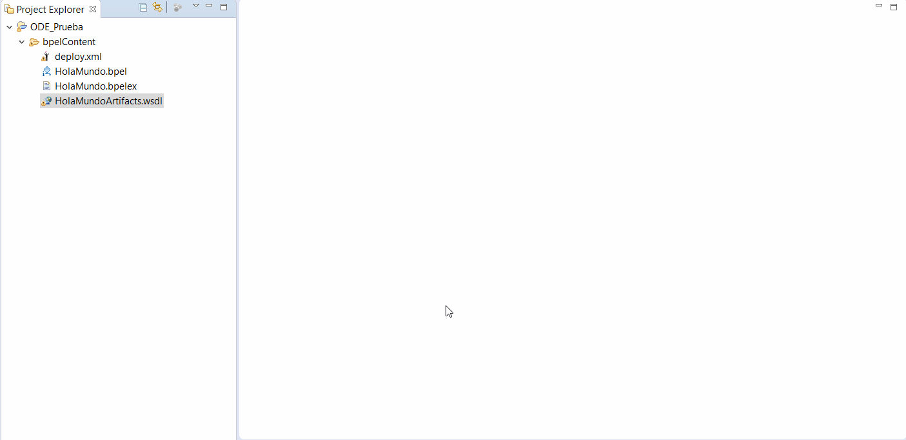

# Overview

Eclipse demo project with the orchestration  engine [Apache ODE](http://ode.apache.org/) and [WS-BPEL](https://es.wikipedia.org/wiki/WS-BPEL).

# Versions

* Windows 10 x64 Education
* Eclipse Java EE IDE for Web Developers
  * Neon.3 Release (4.6.3)
  * Addon: BPEL Designer 1.0.5
* Java
  * jdk1.8.0
  * jre1.8.0
* Apache Tomcat 9.0.13
* Apache ODE 1.3.6

# Installation

I have tried several times to install it and this is the only method that has worked for me.

## Configure Java
* Download Java 1.8
* Add Java to environment variables
  * _Windows > Search > Edit environmental variables for your account_
  * System variables > New
    * ```JAVA_HOME: C:\Program Files\Java\jdk1.8.0_x```
    * ```JAVA_JRE: C:\Program Files\Java\jre1.8.0_x```

## Configure Eclipse and BPEL Designer
* Download [Eclipse Neon](https://www.eclipse.org/neon/) and perform a fresh installation.
* In Eclipse, go to _Help > Install new softwre > Add..._
  * ```Name: BPEL Designer```
  * ```Location: http://download.eclipse.org/bpel/site/1.0.5/```
* _OK > Accept licenses > Install_ and restart Eclipse

## Configure Tomcat
* Download Tomcat 9
  * Go to https://tomcat.apache.org/download-90.cgi
  * Select _9.0.13 > Binary distribution > Core > 64-bit Windows.zip_
* Unzip on C:\ and rename to tomcat9 so you have ```C:\tomcat9```
* Install the service
  * Move to ```C:\tomcat9\bin```
  * Execute ```.\service.bat install```
* Change the port to be 9090
  * Edit the file ```C:\tomcat9\conf\server.xml```and change the line ```<Connector port="8080"...``` to be ```<Connector port="9090"...```

## Configure ODE
* Download Apache ODE 1.3.6 from its [website](http://ode.apache.org/getting-ode.html), unzip and get the ```ode.war``` file. You can remove the rest of the files.
  * Alternatively, you can download that file directly from [this repository](files/ode.war).
* Move the file to the webapps/ Tomcat directory, ```C:\tomcat9\webapps```.
* Launch Tomcat
  * Move to ```C:\tomcat9\bin```
  * Execute ```.\startup.bat```
* A file called ```ode``` will be created on ```C:\tomcat9\webapps\ode```
* Close the tomcat console

## Add ODE to Eclipse
* On Eclipse, go to _Window > Preferences > Server > Runtime environments > Add >_ and select ```Apache Ode 1.x Runtime```
  * Configuration of the Runtime
    * ```JRE: jre1.8.0_x```
    * ```ODE's home directory: C:\tomcat9\webapps\ode```
    * ```Tomcat's home directory: C:\tomcat9\```
    * ```Server address: localhost```
    * ```Port: 9090```
    * ```VM arguments: -Xms128m -Xmx512m -XX:MaxPermSize=256m```
* Add the ```tomcat-juli.jar``` library to the server classpath
  * Go to the _Server_ tab and double click on _Ode 1.x Server_
  * Click on _Open launch configuration > Classpath > User entries_
  * Click on _Add external JARs_
  * Go to ```C:\tomcat9\bin``` and select ```tomcat-juli.jar```
* Change the port to be 9090
  * Go to the _Server_ tab and double click on _Ode 1.x Server_
  * Click on _Runtime environment_ and change the port to ```9090```

# Project configuration

## Create the project
* Create a BPEL project on _Eclipe menu > New > Other... > BPEL 2.0 > BPEL project_.
  * ```Project name: ODE_Pruba```
  * ```Tarjet runtime: Apache Ode 1.x Runtime```
  * ```Configuration: Default configuration for Apache ODE 1.x```
  * Finish

## Create a BPEL process
* Go to the project/bpelContent/, and right click, _New > Other... > BPEL 2.0 > BPEL process file > Next_ and configure it
  * ```Creation mode: Create BPEL process from a template```
  * ```Process name: HolaMundo```
  * ```Namespace: http://holamundo```
  * ``` Abstract process``` unchecked
  * Next
  * ```Template: Synchronous BPEL Process```
  * ```Service name: HolaMundoService```
  * ```Service adress: http://localhost:8080/ode/processes/HolaMundo```
  * ```Binding protocol: SOAP```
  * Finish
* Select the file that has been created (```Holamundo.bpel```), double click and select _Design_
* Remove the Action ```FIX_ME-Add_Business_Logic_Here``` and drop-and-drag from _Action > Assign_
* On _Assign_, right click _Show on properties_
* Go to _Details_ and click on _New_
  * On _From_, select Variable and ```input : HolaMundoRequestMessage > payload : HolaMundoRequestMessage > input : String```
  * On _To_, select Variable and ```output : HolaMundoRequestMessage > payload : HolaMundoRequestMessage > result : String```
* Click ouside and a message will pop up asking to generate a variable, say ```Yes```.

* Save the file

## Create a BPEL deployment descriptor
* Go to the project/bpelContent/, and right click, _New > Other... > BPEL 2.0 > BPEL deployment descriptor > Finish_
* Open it and go to _Inbound interfaces (services) > Associated port>_ and select _HolaMundoPort_.
* Just click on _Related service_ and everything will autocomplete automatically.

* Save the file

## Deploy the process
* Select the server, right click and _Add or remove..._, add the ODE_Pruba project and click on _Finish_

* Go to ```http://localhost:9090/ode/deployment/services/``` and make sure the ```HolaMundo``` process is deployed

## Execution
* Go to HolaMundoArtifact.wsdl, right click, _Web Services > Test with Web Services explorer_
* Click in _Operations > process_
* If nothing appears, press F5 to refresh the browser
* Input a message on the _input_ textbox and press _Go_
* Can you _even_ believe what you are gazing at?


